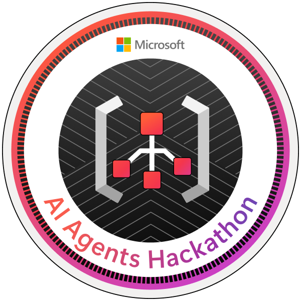

<!-- Profile Readme with Light/Dark Mode Switch & Animated Header -->
---

  

---

  

---

## 👋 About Me

🎓 I'm a final-year Computer Engineering student at **AISSMS COE, Pune**  
💡 Passionate about **AI/ML**, full-stack engineering & real-world innovation  
🏆 Recently earned a **Microsoft Hackathon Badge** (🔥)

---

## 🧠 Projects I’ve Built

| Project | Description | Tech Stack |
|--------|-------------|------------|
| ⚖️ [Lawgic](https://github.com/AparimeyaTiwari/LAWGIC_SUBMISSION) | AI-powered legal assistant for India | Azure, Chainlit, NLP, LLMs |
| 🍅 [Tomato Disease Detector](https://github.com/Vinayak-Khavare/Tomato-Disease-Classification) | Detects tomato leaf diseases (92% accuracy) | CNN, TensorFlow, FastAPI |
| 💰 [Finny - Finance Buddy](https://github.com/AparimeyaTiwari/Finny-The-finance-buddy/tree/vinayak) | Discord AI bot to make finance fun | Python, Discord API, NLP |
| 🎥 [ProctoCam](https://github.com/adwait-rao/ProctoCam) | Smart proctoring using gaze detection | OpenCV, Flask |

---

## 🔧 Tech Stack

---

## 🧩 Fun Facts

- 💡 Always experimenting with NLP, LLMs, and AI Agents
- 📈 I love working on products that simplify lives (esp. legal & finance tools)
- 💬 Fluent in English, Hindi, Marathi; Beginner in Japanese 🇯🇵 and German 🇩🇪
- 🧠 Daily DSA on LeetCode + Tech Blogs = 🧃Fuel for brain

---

## 🏆 Recent Badge

---

## 🔗 Connect with Me

---

  

  
  

---

## 🎨 Light/Dark Mode Support

> This profile is fully responsive to light/dark GitHub themes.  
> Try toggling your GitHub appearance settings and see the magic! ✨
